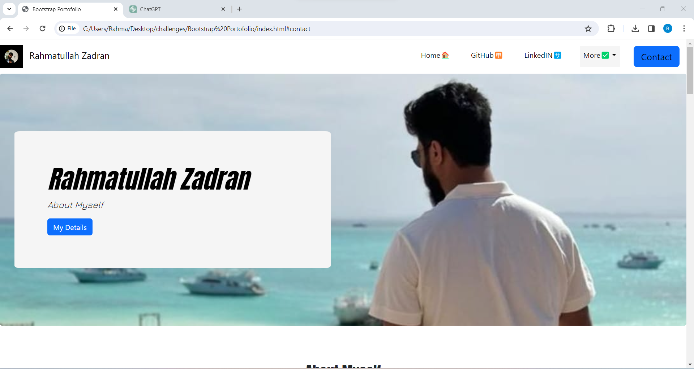

#Bootstrap Portofolio

## imporved version from the first project

## example image 

## Link
[Click here to visit git hub](https://www.google.com)

This portofolio is redone using the bootstrap, which has a solight improvement, however due to time could not complete as intended.

This page is more engaging for the viewers and also easier to use, with the navbar being available, the viewer can locate the information quicker

git 